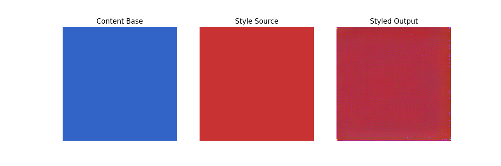

# PRODIGY_GA_05: Neural Style Transfer (NST)

This repository contains my submission for **Task 5 (Bonus)** of my Generative AI Internship at Prodigy InfoTech.

🚀 Project Overview
The goal of this project is to implement an optimization-based **Neural Style Transfer (NST)** algorithm. Using a pre-trained VGG-19 convolutional network, the pipeline blends the structural contents of one target image with the distinct artistic textures and color patterns of a style reference canvas.

📊 Matrix Results
Below is the feature map blend visualization generated by the optimization steps:

🧠 Theory Learned
- **Feature Extraction Hierarchy:** Deep networks capture high-level structural layouts in deeper layers (used for content alignment) and finer pixel properties in early layers.
- **Gram Matrix Calculations:** Style textures are mathematically captured by computing the inner product of feature maps across channels, removing spatial context while preserving raw color and pattern correlations.
- **Perceptual Optimization Loss:** Minimizing a multi-task cost function consisting of MSE-based structural loss combined with Gram-matrix texture loss.

🛠️ Technology Stack
- Python 3
- PyTorch & Torchvision (Pre-trained VGG-19)
- Matplotlib
- Google Colab (T4 GPU Accelerated Runtime)
